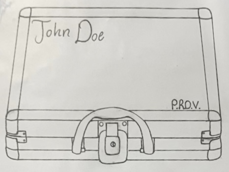
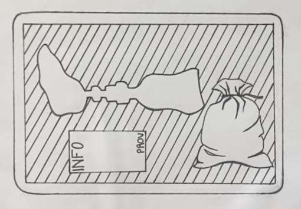

<br>

### Aspects of Packaging

P.R.O.V.’s packaging is designed with equal focus on functionality, durability, and personalization, ensuring a high-quality unboxing experience that reflects the care behind every product. Each prosthetic is securely housed in a sleek metal case, similar in appearance to a premium poker chip case, offering both style and resilience. The interior of the case features a custom-cut foam insert tailored specifically to the customer’s prosthetic, allowing for safe storage and easy transportation. Reinforced metal corners enhance the overall structural integrity of the case, preventing potential damage during handling or transit.

A unique feature of the packaging is the personalized engraving of the customer’s name, located on the top left corner of the case lid. This thoughtful detail not only elevates the sense of ownership but also highlights P.R.O.V.'s commitment to user-focused design. Beyond aesthetics, the practicality of the packaging is paramount—the metal case is built to last, offering users a long-term solution for safely storing and transporting their prosthetic when not in use. Another feature is the velvet travel bag used for any accessories, add-ons, or spare parts for the prosthetic. 

For shipping, the metal case is placed inside waterproof cardboard packaging, which adds an additional layer of protection. Between the outer box and the case, Styrofoam inserts provide shock absorption to ensure the prosthetic remains fully protected throughout delivery. The outer packaging includes all required information, such as distributor details, UPC, and safety warnings, printed clearly in both English and French. A multilingual pamphlet with additional translations is enclosed inside the box. The P.R.O.V. logo and brand name are prominently displayed on the top and front of the box, reinforcing brand recognition while maintaining a clean and professional look. Together, these elements demonstrate P.R.O.V.’s dedication to quality, customer experience, and dependable design.

### Packaging Design

<br>

```{r, echo=FALSE}



```

```{r, echo=FALSE}



```

<br>

### Advantages

1. Enhanced Protection and Durability
The use of a metal case with reinforced corners provides superior protection during shipping, handling, and everyday use. Prosthetic devices are highly personalized and often represent a significant investment—physically, emotionally, and financially. This packaging ensures that the product arrives in pristine condition and remains protected when stored or transported later. The durable foam insert further secures the device, minimizing any internal movement that could lead to scratches, misalignment, or wear over time.

2. Reusability and Practical Value
Unlike traditional packaging that’s often discarded, this case is intentionally designed for long-term use. Its custom-fit foam insert and compact, sturdy structure allow users to store or transport their prosthetic safely whenever needed—at home, while traveling, or during rehab sessions. This makes the case more than just packaging—it becomes a functional accessory that adds ongoing value to the customer’s daily life.

3. Premium Brand Presentation
High-quality materials and a sleek, professional design immediately communicate that P.R.O.V. is a premium, trustworthy brand. First impressions matter, especially in healthcare and assistive technologies where quality and reliability are critical. The case not only protects the product but elevates the unboxing experience, reinforcing the idea that the customer is receiving a carefully engineered, thoughtfully presented solution—not just a piece of equipment.

---

[← Back to Table of Contents](mark_business_plan.html)

[← Back to Home](index.html)