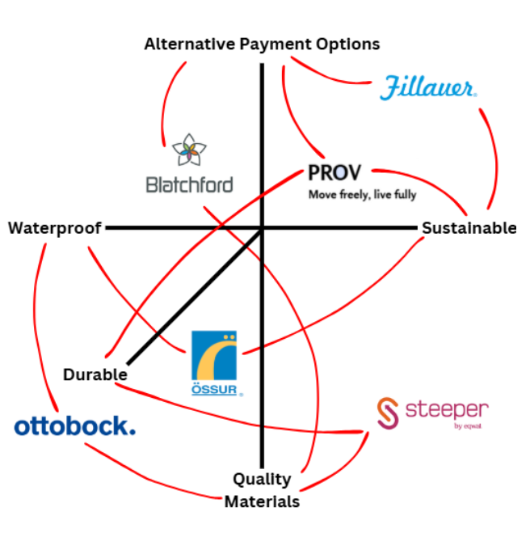

<br>

#### Athletes

- Athletes are more likely to have long-term injuries that last until later in life, requiring orthotic support and occasionally prosthetics, depending on injury. 

- There is an increasing number of people who have suffered from injuries and are in need of prosthetics, who then use the opportunity to expand their experiences and take charge of that aspect of their life.

#### Middle-Aged and Older (40+)

- Orthotics are often used by people later in life, whether it is due to wear on their joints or injuries from their youth that have caused lasting effects on their body.

- Orthotics also are helpful for people in older generations, as it helps support their joints in high intensity environments, where they may be more likely to sustain an injury.

#### Middle to High Income Homes

- Due to prosthetics and orthotics being an expensive solution for amputations or joint injuries, marketing is mainly directed towards middle to high income homes. 

- People in need of prosthetics or orthotics who are in lower to middle income homes are also given opportunities through grants or fundraisers, but would have to have select requirements and thorough applications. 

---

## Perceptual Map

<br>

```{r, echo=FALSE}



```

---

[← Back to Table of Contents](mark_business_plan.html)

[← Back to Home](index.html)